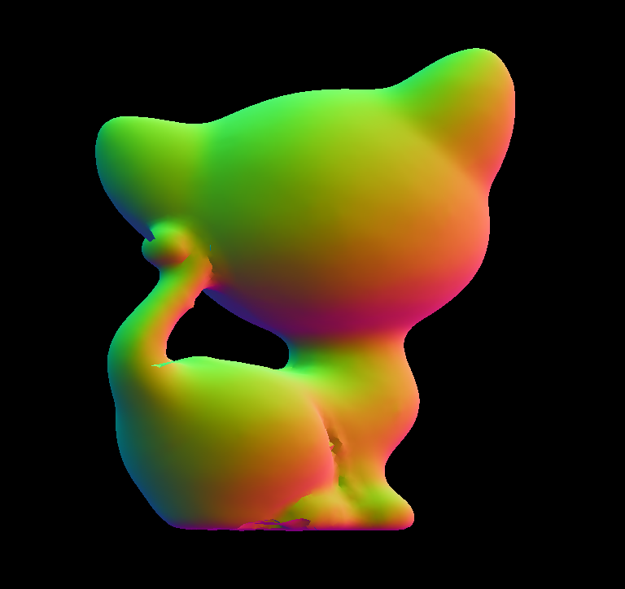
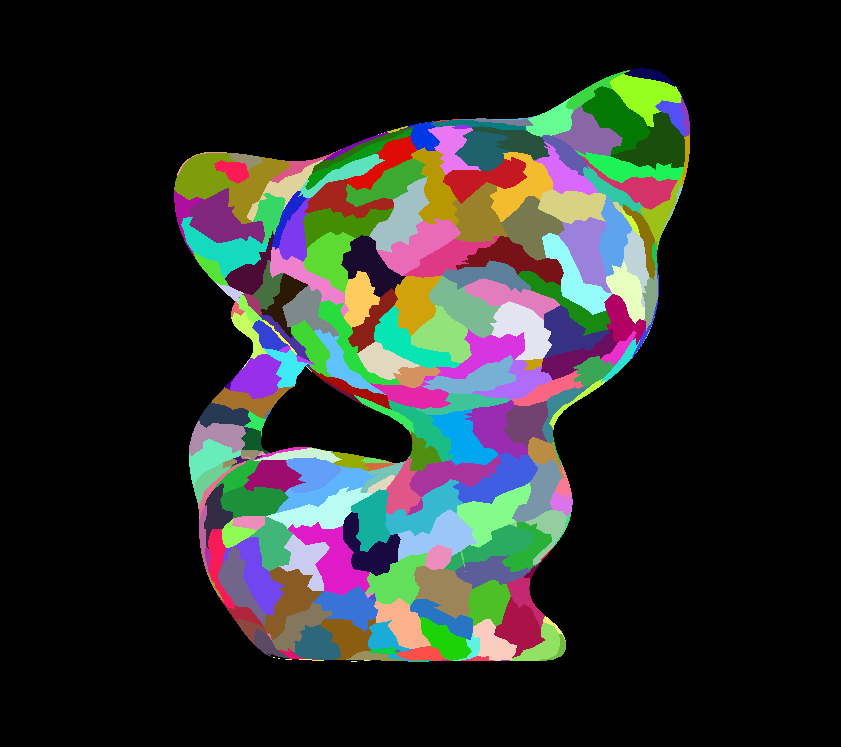
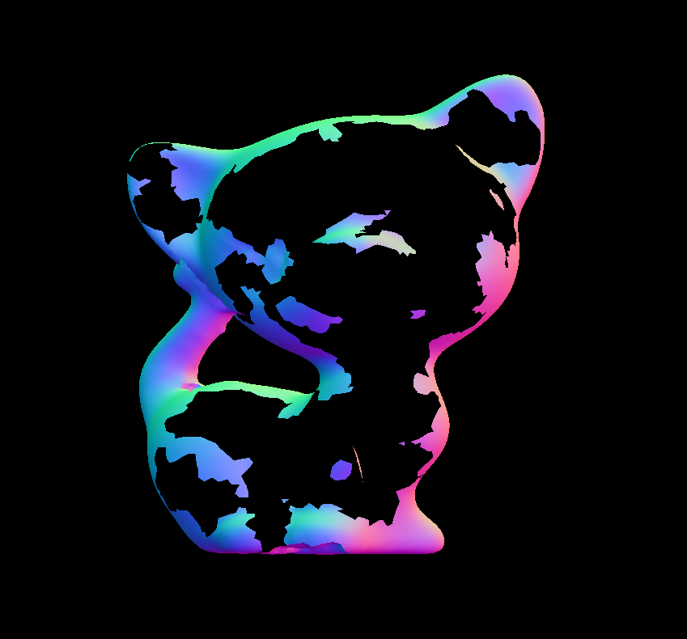
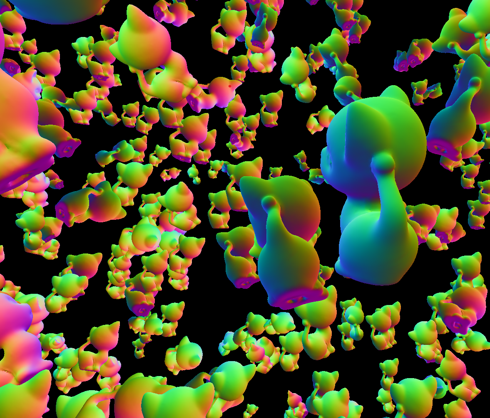

# Efficient-Vulkan-Renderer

* Learning how to write an efficiency-driven Vulkan renderer with [Arseny Kapoulkine's niagara renderer video series](https://youtu.be/BR2my8OE1Sc)

* Implementing an optimized version of object culling done on the GPU

* Serves as an experimental ground for any interesting rendering algorithm

# Implemented Features

## Geometry Rendering Optimization & GPU-based Rendering Pipeline Goals:
    1. Minimize the amount of triangles sent to the vertex shader & (more importantly) rasterization stage
    2. Save the number of draw calls submitted from the CPU side
    3. Memory-cache friendly buffers & utilization

* Mesh rendering with meshlet generation & optimization and mesh shader. 

    

    * Visualized meshlets

    

* Meshlet culling

    * Meshlet culling done by cone testing. The idea is learnt from Arseny Kapoulkine and a siggraph sharing from Assassin's Creed: Unity team. The idea is such:
        1. For a meshlet with many triangles, we first compute an average normal and a max degree angle 'a' that a 
        single triangle's normal can be away from the average normal.
        2. Then, a backfacing cone should have an angle betweeen avg normal & view dir less than (-a + 90 degrees) 
        such that even the farthest normal direction from the view dir in the meshlet is backfacing
        3. We store cos value only instead of degree angle. In shader, since the greater the cos value is the less the angle is in between, dot(avg normal, view dir) > cos(-a + 90) means the meshlet is backfacing
        4. Math: cos(-a + 90) = sin(a) = sqrt(1 - cos(a)^2)
        5. Corner case 1: if the meshlet has triangles with normal distributing over a range of over 180 degrees, no matter what the view direction is, we can see some triangles so the meshlet must be kept.
        6. Corner case 2: Perpective projection requires an apex or a bounding sphere to be sent to the shader to compute the correct viewing direction or a conservative cutoff

    * Implementation is done with a combination of task & mesh shader where task shader only dispatches mesh shaders if a meshlet is not culled

    * This image is rendered by enabling meshlet culling and also culling front-facing triangles in rasterization stage to show the result.

    

    * This image is the result without meshlet culling

    

* Indirect draw command

    * Draws a lot of meshes with only one draw call and an additional draw command data buffer. The buffer contains the necessary info to give each mesh its own draw command & optional constants.

    

* With 3000 meshes each with 33000 triangles, meshlet backface culling achieves 30% less rendering time per frame than traditional indexed-vertex rendering. Both with indirect drawing enabled to eliminate draw call bottleneck. 

* Frustum Culling

    * Frustum culling is done by determining if a mesh is outside the frustum defined by a projection matrix. The six planes of the frustum can be found as such:
        * For example on x-axis, projection matrix confines a **projected point** (x, y, z, w) to a clip space of 
        
            $-1 < x / w < 1 <=> -w < x < w <=> x + w > 0 \quad and \quad x - w < 0 $
        
            Suppose the original point is v and the four rows of projection matrix are p1, p2, p3, p4, then 

            $x = dot(p1, v) \quad and \quad w = dot(p4, v)$
         
            $ x + w > 0 <=> dot(p1 + p4, v) > 0$

            This inequality also means that if a plane is defined by $(p1 + p4)$ , then v is in the positive half space of the plane. Here we have successfully found a frustum plane. Similar process applies to all planes.
        * After we have all frustum planes found, a bounding sphere is outside the frustum space if it is outside any of the six plane. 

* After frustum culling is implemented for both mesh shading pipeline and verter shading pipeline, performance significantly increases for 10+ times but performance gap is brought closer to 10% for the same test environment. The reduction in triangle count partially resolved the bottleneck in rasterization stage for vertex shading pipeline. 

* Maybe a frustum culling of larger chunks in the space acceleration structures such as bvh can be first done on the CPU. And the meshes left in the remaining chunks can be further culled in GPU to maximize performance.
